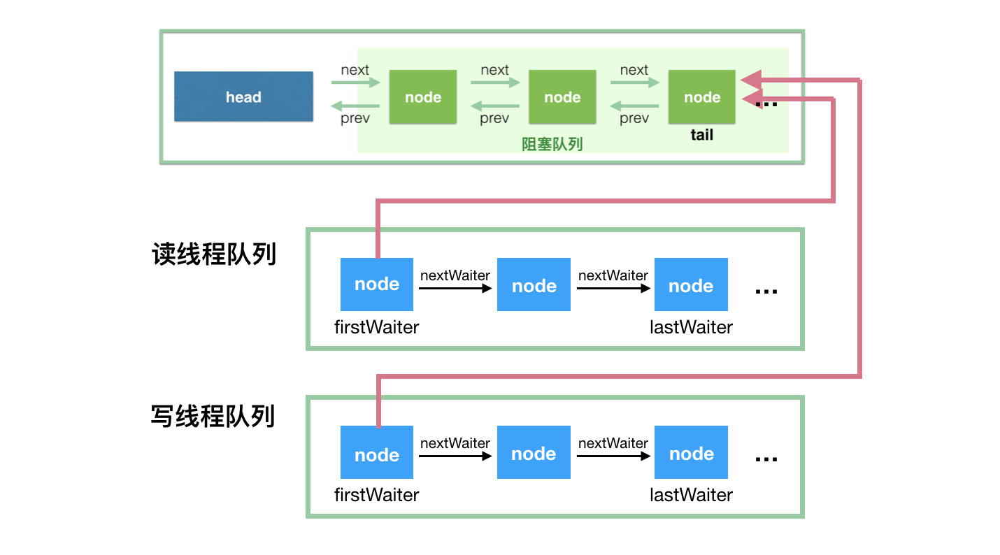

# BlockingQueue

BlockingQueue 对插入操作、移除操作、获取元素操作提供了四种不同的方法用于不同的场景中使用：1、抛出异常；2、返回特殊值（null 或 true/false，取决于具体的操作）；3、阻塞等待此操作，直到这个操作成功；4、阻塞等待此操作，直到成功或者超时指定时间。

| 表头 | Throws exception | Special value | Blocks | Times out |
| :----: | :----: | :----: | :----: | :----: |
| Insert | add(e) | offer(e) | **put(e)** | offer(e, time, unit) |
| Remove | remove() | poll() | **take()** | poll(time, unit) |
| Examine | element() | peek() | not applicable | not applicable |

> 对于 BlockingQueue，我们的关注点应该在 put(e) 和 take() 这两个方法，因为这两个方法是带阻塞的。

BlockingQueue 不接受 null 值的插入，相应的方法在碰到 null 的插入时会抛出 NullPointerException 异常。null 值在这里通常用于作为特殊值返回（表格中的第三列），代表 poll 失败。

一个 BlockingQueue 可能是有界的，如果在插入的时候，发现队列满了，那么 put 操作将会阻塞。

BlockingQueue 是设计用来实现生产者-消费者队列的，可以用 remove(x) 来删除任意一个元素，但是，这类操作通常并不高效，所以尽量只在少数的场合使用，比如一条消息已经入队，但是需要做取消操作的时候。

BlockingQueue 的实现都是线程安全的，但是批量的集合操作如 addAll, containsAll, retainAll 和 removeAll  不一定是原子操作。如 addAll(c) 有可能在添加了一些元素后中途抛出异常，此时 BlockingQueue 中已经添加了部分元素，这个是允许的，取决于具体的实现。

## 实现 ArrayBlockingQueue

ArrayBlockingQueue 是 BlockingQueue 接口的有界队列实现类，底层采用数组来实现。其并发控制采用可重入锁来控制，不管是插入操作还是读取操作，都需要获取到锁才能进行操作。

ArrayBlockingQueue 采用一个 ReentrantLock 和相应的两个 Condition 来实现。

```java
// 用于存放元素的数组
final Object[] items;
// 下一次读取操作的位置
int takeIndex;
// 下一次写入操作的位置
int putIndex;
// 队列中的元素数量
int count;
// 以下几个就是控制并发用的同步器
final ReentrantLock lock;
private final Condition notEmpty;
private final Condition notFull;
```



ArrayBlockingQueue 实现并发同步的原理就是，读操作和写操作都需要获取到 AQS 独占锁才能进行操作。如果队列为空，这个时候读操作的线程进入到**读线程队列**排队，等待写线程写入新的元素，然后唤醒读线程队列的第一个等待线程。如果队列已满，这个时候写操作的线程进入到**写线程队列**排队，等待读线程将队列元素移除腾出空间，然后唤醒写线程队列的第一个等待线程。

可以在构造的时候指定以下三个参数：

* 队列容量，其限制了队列中最多允许的元素个数；
* 指定独占锁是公平锁还是非公平锁。非公平锁的吞吐量比较高，公平锁可以保证每次都是等待最久的线程获取到锁；
* 可以指定用一个集合来初始化，将此集合中的元素在构造方法期间就先添加到队列中。

未完待续 https://javadoop.com/post/java-concurrent-queue