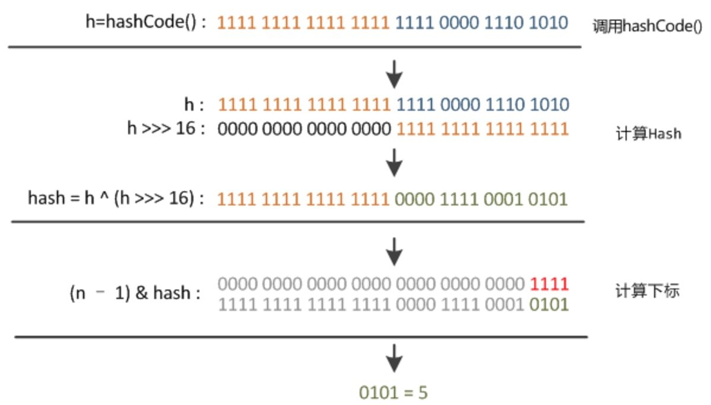

## HashMap


### 介绍
接口java.util.Map,此接口主要有四个常用的实现类,分别是HashMap、Hashtable、LinkedHashMap和TreeMap。
* HashMap: 根据键的 hashCode 值存数据,大多数情况可以直接定位值,访问速度快。支持 null 作为键。如果需要满足线程安全,可以用 Collections的synchronizedMap方法使HashMap具有线程安全的能力。
* Hashtable: 遗留类,不建议用。
* LinkedHashMap: 底层使用 HashMap,保存了值插入的顺序。
* TreeMap: 默认根据键升序排序。使用时,key 必须实现 Comparable 接口或者构造 TreeMap 时传入自定义的 Comparator 。
> 以上均要求 key 不可变,或者说 key 的 hashCode 不可变。

HashMap 原理,好好通读该文章 https://zhuanlan.zhihu.com/p/21673805 

### 存储结构-字段


* HashMap 中用 Node[] table **哈希桶数组**存数据。Node是HashMap的一个内部类,实现了Map.Entry接口,本质是就是一个映射(键值对)。
```java
static class Node<K,V> implements Map.Entry<K,V> {
    final int hash;    //用来定位数组索引位置
    final K key;
    V value;
    Node<K,V> next;   //链表的下一个node

    Node(int hash, K key, V value, Node<K,V> next) {...}
    public final K getKey(){ ... }
    public final V getValue() { ... }
    public final String toString() { ... }
    public final int hashCode() { ... }
    public final V setValue(V newValue) { ... }
    public final boolean equals(Object o) { ... }
}
```

* HashMap 使用**链地址法**解决冲突,数据被哈希时,计算出数组下标,当下标冲突,则往后接链表。
> `map.put("美团","小美");` 时,先`hashCode()`计算哈希值,然后两步运算(高位运算和取模)出下标。

* 优秀的Hash算法和扩容机制可以大大降低Hash碰撞。
```java
int threshold;             // 所能容纳的key-value对极限 
final float loadFactor;    // 负载因子,默认0.75
int modCount;  
int size;
```
Node[] table 初始长度是16,`threshold = length * Loadfactor`,数组定义好长度之后,负载因子越大,所能容纳的键值对个数越多。当元素个数超过 threshold 之后,HashMap 扩容。
> 除非在时间和空间比较特殊的情况下,如果内存空间很多而又对时间效率要求很高,可以降低负载因子Load factor的值;相反,如果内存空间紧张而对时间效率要求不高,可以增加负载因子loadFactor的值,这个值可以大于1。

size 就是HashMap中实际存在的键值对数量,HashMap中,哈希桶数组table的长度length大小必须为2的n次方。

### 实现
#### 定位
```java
方法一：
static final int hash(Object key) {//jdk1.8 & jdk1.7
    int h;
    // h = key.hashCode() 为第一步 取hashCode值
    // h ^ (h >>> 16)  为第二步 高位参与运算
    return (key == null) ? 0 : (h = key.hashCode()) ^ (h >>> 16);
}
方法二：
static int indexFor(int h, int length) {//jdk1.7的源码，jdk1.8没有这个方法，但是实现原理一样的
    return h & (length-1);  //第三步 取模运算
}
```
> 这里的Hash算法本质上就是三步：取key的hashCode值、高位运算、取模运算。

> 当length总是2的n次方时，h& (length-1)运算等价于对length取模，也就是h%length，但是&比%具有更高的效率。



#### put


```java
public V put(K key, V value) {
    // 对key的hashCode()做hash
    return putVal(hash(key), key, value, false, true);
}
 5 
final V putVal(int hash, K key, V value, boolean onlyIfAbsent,boolean evict) {
    Node<K,V>[] tab; Node<K,V> p; int n, i;
    // 步骤①：tab为空则创建
    if ((tab = table) == null || (n = tab.length) == 0)
        n = (tab = resize()).length;
    // 步骤②：计算index，并对null做处理 
    if ((p = tab[i = (n - 1) & hash]) == null) 
        tab[i] = newNode(hash, key, value, null);
    else {
        Node<K,V> e; K k;
        // 步骤③：节点key存在，直接覆盖value
        if (p.hash == hash && ((k = p.key) == key || (key != null && key.equals(k))))
            e = p;
        // 步骤④：判断该链为红黑树
        else if (p instanceof TreeNode)
            e = ((TreeNode<K,V>)p).putTreeVal(this, tab, hash, key, value);
        // 步骤⑤：该链为链表
        else {
            for (int binCount = 0; ; ++binCount) {
                if ((e = p.next) == null) {
                    p.next = newNode(hash, key,value,null);
                    //链表长度大于8转换为红黑树进行处理
                    if (binCount >= TREEIFY_THRESHOLD - 1) // -1 for 1st  
                        treeifyBin(tab, hash);
                    break;
                }
                // key已经存在直接覆盖value
                if (e.hash == hash &&
                    ((k = e.key) == key || (key != null && key.equals(k)))) break;
                p = e;
            }
        }
        if (e != null) { // existing mapping for key
            V oldValue = e.value;
            if (!onlyIfAbsent || oldValue == null)
                e.value = value;
            afterNodeAccess(e);
            return oldValue;
        }
    }
    ++modCount;
    // 步骤⑥：超过最大容量 就扩容
    if (++size > threshold)
        resize();
    afterNodeInsertion(evict);
    return null;
}
```