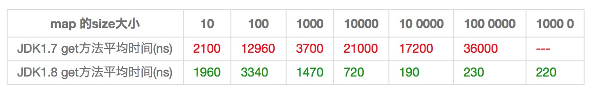

## HashMap


### 1 介绍
接口java.util.Map,此接口主要有四个常用的实现类,分别是HashMap、Hashtable、LinkedHashMap和TreeMap。
* HashMap: 根据键的 hashCode 值存数据,大多数情况可以直接定位值,访问速度快。支持 null 作为键。如果需要满足线程安全,可以用 Collections的synchronizedMap方法使HashMap具有线程安全的能力。
* Hashtable: 遗留类,不建议用。
* LinkedHashMap: 底层使用 HashMap,保存了值插入的顺序。
* TreeMap: 默认根据键升序排序。使用时,key 必须实现 Comparable 接口或者构造 TreeMap 时传入自定义的 Comparator 。
> 以上均要求 key 不可变,或者说 key 的 hashCode 不可变。

HashMap 原理,好好通读该文章 https://zhuanlan.zhihu.com/p/21673805 

### 2 存储结构-字段


* HashMap 中用 Node[] table **哈希桶数组**存数据。Node是HashMap的一个内部类,实现了Map.Entry接口,本质是就是一个映射(键值对)。
```java
static class Node<K,V> implements Map.Entry<K,V> {
    final int hash;    //用来定位数组索引位置
    final K key;
    V value;
    Node<K,V> next;   //链表的下一个node

    Node(int hash, K key, V value, Node<K,V> next) {...}
    public final K getKey(){ ... }
    public final V getValue() { ... }
    public final String toString() { ... }
    public final int hashCode() { ... }
    public final V setValue(V newValue) { ... }
    public final boolean equals(Object o) { ... }
}
```

* HashMap 使用**链地址法**解决冲突,数据被哈希时,计算出数组下标,当下标冲突,则往后接链表。
> `map.put("美团","小美");` 时,先`hashCode()`计算哈希值,然后两步运算(高位运算和取模)出下标。

* 优秀的Hash算法和扩容机制可以大大降低Hash碰撞。
```java
int threshold;             // 所能容纳的key-value对极限 
final float loadFactor;    // 负载因子,默认0.75
int modCount;  
int size;
```
Node[] table 初始长度是16,`threshold = length * Loadfactor`,数组定义好长度之后,负载因子越大,所能容纳的键值对个数越多。当元素个数超过 threshold 之后,HashMap 扩容。
> 除非在时间和空间比较特殊的情况下,如果内存空间很多而又对时间效率要求很高,可以降低负载因子Load factor的值;相反,如果内存空间紧张而对时间效率要求不高,可以增加负载因子loadFactor的值,这个值可以大于1。

size 就是HashMap中实际存在的键值对数量,HashMap中,哈希桶数组table的长度length大小必须为2的n次方。

### 3 实现
#### 3.1 定位
```java
方法一：
static final int hash(Object key) {//jdk1.8 & jdk1.7
    int h;
    // h = key.hashCode() 为第一步 取hashCode值
    // h ^ (h >>> 16)  为第二步 高位参与运算
    return (key == null) ? 0 : (h = key.hashCode()) ^ (h >>> 16);
}
方法二：
static int indexFor(int h, int length) {//jdk1.7的源码，jdk1.8没有这个方法，但是实现原理一样的
    return h & (length-1);  //第三步 取模运算
}
```
> 这里的Hash算法本质上就是三步：取key的hashCode值、高位运算、取模运算。

> 当length总是2的n次方时，h& (length-1)运算等价于对length取模，也就是h%length，但是&比%具有更高的效率。


> HashMap 判断key是否想等，关键代码
```java
if (e.hash == hash && ((k = e.key) == key || (key != null && key.equals(k)))) {
    ...
}
```

#### 3.2 put


```java
public V put(K key, V value) {
    // 对key的hashCode()做hash
    return putVal(hash(key), key, value, false, true);
}
 5 
final V putVal(int hash, K key, V value, boolean onlyIfAbsent,boolean evict) {
    Node<K,V>[] tab; Node<K,V> p; int n, i;
    // 步骤①：tab为空则创建
    if ((tab = table) == null || (n = tab.length) == 0)
        n = (tab = resize()).length;
    // 步骤②：计算index，并对null做处理 
    if ((p = tab[i = (n - 1) & hash]) == null) 
        tab[i] = newNode(hash, key, value, null);
    else {
        Node<K,V> e; K k;
        // 步骤③：节点key存在，直接覆盖value
        if (p.hash == hash && ((k = p.key) == key || (key != null && key.equals(k))))
            e = p;
        // 步骤④：判断该链为红黑树
        else if (p instanceof TreeNode)
            e = ((TreeNode<K,V>)p).putTreeVal(this, tab, hash, key, value);
        // 步骤⑤：该链为链表
        else {
            for (int binCount = 0; ; ++binCount) {
                if ((e = p.next) == null) {
                    p.next = newNode(hash, key,value,null);
                    //链表长度大于8转换为红黑树进行处理
                    if (binCount >= TREEIFY_THRESHOLD - 1) // -1 for 1st  
                        treeifyBin(tab, hash);
                    break;
                }
                // key已经存在直接覆盖value
                if (e.hash == hash &&
                    ((k = e.key) == key || (key != null && key.equals(k)))) break;
                p = e;
            }
        }
        if (e != null) { // existing mapping for key
            V oldValue = e.value;
            if (!onlyIfAbsent || oldValue == null)
                e.value = value;
            afterNodeAccess(e);
            return oldValue;
        }
    }
    ++modCount;
    // 步骤⑥：超过最大容量 就扩容
    if (++size > threshold)
        resize();
    afterNodeInsertion(evict);
    return null;
}
```

#### 3.3 扩容机制
当然Java里的数组是无法自动扩容的，方法是使用一个新的数组代替已有的容量小的数组，当然Java里的数组是无法自动扩容的，方法是使用一个新的数组代替已有的容量小的数组。
```java
void resize(int newCapacity) {   //传入新的容量
    Entry[] oldTable = table;    //引用扩容前的Entry数组
    int oldCapacity = oldTable.length;         
    if (oldCapacity == MAXIMUM_CAPACITY) {  //扩容前的数组大小如果已经达到最大(2^30)了
        threshold = Integer.MAX_VALUE; //修改阈值为int的最大值(2^31-1)，这样以后就不会扩容了
        return;
    }
 
    Entry[] newTable = new Entry[newCapacity];  //初始化一个新的Entry数组
    transfer(newTable); //！！将数据转移到新的Entry数组里
    table = newTable;   //HashMap的table属性引用新的Entry数组
    threshold = (int)(newCapacity * loadFactor);//修改阈值
}
```
使用一个容量更大的数组来代替已有的容量小的数组，transfer()方法将原有Entry数组的元素拷贝到新的Entry数组里。newTable[i]的引用赋给了e.next，也就是使用了单链表的头插入方式，同一位置上新元素总会被放在链表的头部位置；这样先放在一个索引上的元素终会被放到Entry链的尾部(如果发生了hash冲突的话）

java7 扩容的时候，会因为重新hash，导致节点的数组顺序随机。Java8 因为每次扩容都是*2，所以元素要么在原来的位置，要么在原位置再移动2次幂的位置。


a) 表示扩容前的key1和key2两种key确定索引位置的示例

b) 表示扩容后key1和key2两种key确定索引位置的示例

元素在重新计算hash之后，因为n变为2倍，那么n-1的mask范围在高位多1bit(红色)，因此新的index就会发生这样的变化：


因此，我们在扩充HashMap的时候，不需要像JDK1.7的实现那样重新计算hash，只需要看看原来的hash值新增的那个bit是1还是0就好了，是0的话索引没变，是1的话索引变成“原索引+oldCap”


这样做不仅效率高省资源，而且不会因为重排导致链表倒序。
```java
// JDK1.8的resize源码
 final Node<K,V>[] resize() {
     Node<K,V>[] oldTab = table;
     int oldCap = (oldTab == null) ? 0 : oldTab.length;
     int oldThr = threshold;
     int newCap, newThr = 0;
     if (oldCap > 0) {
         // 超过最大值就不再扩充了，就只好随你碰撞去吧
         if (oldCap >= MAXIMUM_CAPACITY) {
             threshold = Integer.MAX_VALUE;
            return oldTab;
        }
        // 没超过最大值，就扩充为原来的2倍
        else if ((newCap = oldCap << 1) < MAXIMUM_CAPACITY &&
                 oldCap >= DEFAULT_INITIAL_CAPACITY)
            newThr = oldThr << 1; // double threshold
    }
    else if (oldThr > 0) // initial capacity was placed in threshold
        newCap = oldThr;
    else {               // zero initial threshold signifies using defaults
        newCap = DEFAULT_INITIAL_CAPACITY;
        newThr = (int)(DEFAULT_LOAD_FACTOR * DEFAULT_INITIAL_CAPACITY);
    }
    // 计算新的resize上限
    if (newThr == 0) {

        float ft = (float)newCap * loadFactor;
        newThr = (newCap < MAXIMUM_CAPACITY && ft < (float)MAXIMUM_CAPACITY ?
                  (int)ft : Integer.MAX_VALUE);
    }
    threshold = newThr;
    @SuppressWarnings({"rawtypes"，"unchecked"})
        Node<K,V>[] newTab = (Node<K,V>[])new Node[newCap];
    table = newTab;
    if (oldTab != null) {
        // 把每个bucket都移动到新的buckets中
        for (int j = 0; j < oldCap; ++j) {
            Node<K,V> e;
            if ((e = oldTab[j]) != null) {
                oldTab[j] = null;
                if (e.next == null)
                    newTab[e.hash & (newCap - 1)] = e;
                else if (e instanceof TreeNode)
                    ((TreeNode<K,V>)e).split(this, newTab, j, oldCap);
                else { // 链表优化重hash的代码块
                    Node<K,V> loHead = null, loTail = null;
                    Node<K,V> hiHead = null, hiTail = null;
                    Node<K,V> next;
                    do {
                        next = e.next;
                        // 原索引
                        if ((e.hash & oldCap) == 0) {
                            if (loTail == null)
                                loHead = e;
                            else
                                loTail.next = e;
                            loTail = e;
                        }
                        // 原索引+oldCap
                        else {
                            if (hiTail == null)
                                hiHead = e;
                            else
                                hiTail.next = e;
                            hiTail = e;
                        }
                    } while ((e = next) != null);
                    // 原索引放到bucket里
                    if (loTail != null) {
                        loTail.next = null;
                        newTab[j] = loHead;
                    }
                    // 原索引+oldCap放到bucket里
                    if (hiTail != null) {
                        hiTail.next = null;
                        newTab[j + oldCap] = hiHead;
                    }
                }
            }
        }
    }
    return newTab;
}
```

### 4 线程安全性
HashMap 非线程安全，多线程时不适用。
```java
// 举例子说明在并发的多线程使用场景中使用HashMap可能造成死循环
public class HashMapInfiniteLoop {
    //当put第二个key的时候，map就需要进行resize
    private static HashMap<Integer,String> map = new HashMap<Integer,String>(2，0.75f);
    public static void main(String[] args) {  
        map.put(5， "C");
        new Thread("Thread1") {
            public void run() {
                map.put(7, "B");
                System.out.println(map);
            };
        }.start();
        new Thread("Thread2") {
            public void run() {
                map.put(3, "A");
                System.out.println(map);
            };
        }.start();
    }
}
```
通过设置断点让线程1和线程2同时debug到transfer方法的首行。注意此时两个线程已经成功添加数据。放开thread1的断点至transfer方法的“Entry next = e.next;” 这一行；然后放开线程2的的断点，让线程2进行resize。结果如下图。


Thread1的 e 指向了key(3)，而next指向了key(7)，其在线程二rehash后，指向了线程二重组后的链表。

线程一被调度回来执行，先是执行 newTalbe[i] = e， 然后是e = next，导致了e指向了key(7)，而下一次循环的next = e.next导致了next指向了key(3)。


e.next = newTable[i] 导致 key(3).next 指向了 key(7)。注意：此时的key(7).next 已经指向了key(3)， 环形链表就这样出现了。


### 5 7和8性能对比
#### 5.1 Hash 优秀的情况
```java
// key 类
class Key implements Comparable<Key> {
    private final int value;
    Key(int value) {
        this.value = value;
    }
    @Override
    public int compareTo(Key o) {
        return Integer.compare(this.value, o.value);
    }
    @Override
    public boolean equals(Object o) {
        if (this == o) return true;
        if (o == null || getClass() != o.getClass())
            return false;
        Key key = (Key) o;
        return value == key.value;
    }
    @Override
    // 任何一个值的hashCode都不会相同
    public int hashCode() {
        return value;
    }
}
```
为了避免频繁的GC，我将不变的Key实例缓存了起来，而不是一遍一遍的创建它们。
```java
public class Keys {
    public static final int MAX_KEY = 10_000_000;
    private static final Key[] KEYS_CACHE = new Key[MAX_KEY];
    static {
        for (int i = 0; i < MAX_KEY; ++i) {
            KEYS_CACHE[i] = new Key(i);
        }
    }
    public static Key of(int value) {
        return KEYS_CACHE[value];
    }
}
```

现在开始我们的试验，测试需要做的仅仅是，创建不同size的HashMap（1、10、100、......10000000），屏蔽了扩容的情况
```java
static void test(int mapSize) {
    HashMap<Key, Integer> map = new HashMap<Key,Integer>(mapSize);
    for (int i = 0; i < mapSize; ++i) {
        map.put(Keys.of(i), i);
    }
    long beginTime = System.nanoTime(); //获取纳秒
    for (int i = 0; i < mapSize; i++) {
        map.get(Keys.of(i));
    }
    long endTime = System.nanoTime();
    System.out.println(endTime - beginTime);
}

public static void main(String[] args) {
    for(int i=10;i<= 1000 0000;i*= 10){
        test(i);
    }
}
```
在测试中会查找不同的值，然后度量花费的时间，为了计算getKey的平均时间，我们遍历所有的get方法，计算总的时间，除以key的数量，计算一个平均值，主要用来比较，绝对值可能会受很多环境因素的影响。


#### 5.2 hash极不均匀
```java
class Key implements Comparable<Key> {
    //...
    @Override
    public int hashCode() {
        return 1;
    }
}
```
仍然执行main方法，得出的结果如下表所示



从表中结果中可知，随着size的变大，JDK1.7的花费时间是增长的趋势，而JDK1.8是明显的降低趋势，并且呈现对数增长稳定。当一个链表太长的时候，HashMap会动态的将它替换成一个红黑树，这话的话会将时间复杂度从O(n)降为O(logn)。

> 测试环境：处理器为2.2 GHz Intel Core i7，内存为16 GB 1600 MHz DDR3，SSD硬盘，使用默认的JVM参数，运行在64位的OS X 10.10.1上。

### 6 小结
* 扩容是一个特别耗性能的操作，所以当程序员在使用HashMap的时候，估算map的大小，初始化的时候给一个大致的数值，避免map进行频繁的扩容。
* 负载因子是可以修改的，也可以大于1，但是建议不要轻易修改，除非情况非常特殊。
* HashMap是线程不安全的，不要在并发的环境中同时操作HashMap，建议使用ConcurrentHashMap。
* JDK1.8引入红黑树大程度优化了HashMap的性能。

### 7 参考

1.  JDK1.7&JDK1.8 源码。
2.  CSDN 博客频道，[HashMap 多线程死循环问题](http://blog.csdn.net/xuefeng0707/article/details/40797085)，2014。
3.  红黑联盟，[Java 类集框架之 HashMap(JDK1.8) 源码剖析](http://www.2cto.com/kf/201505/401433.html)，2015。
4.  CSDN 博客频道， [教你初步了解红黑树](http://blog.csdn.net/v_july_v/article/details/6105630)，2010。
5.  Java Code Geeks，[HashMap performance improvements in Java 8](http://www.javacodegeeks.com/2014/04/hashmap-performance-improvements-in-java-8.html)，2014。
6.  Importnew，[危险！在 HashMap 中将可变对象用作 Key](http://www.importnew.com/13384.html)，2014。
7.  CSDN 博客频道，[为什么一般 hashtable 的桶数会取一个素数](http://blog.csdn.net/liuqiyao_01/article/details/14475159)，2013。