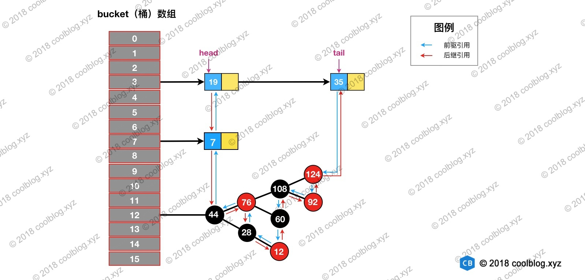

# LinkedHashMap
## 1 概述
继承自 HashMap ，通过维护一条双向链表，解决了 HashMap 不能随时保持遍历顺序和插入顺序一致的问题。在实现上，LinkedHashMap 很多方法直接继承自 HashMap，仅为维护双向链表覆写了部分方法。

## 2 原理
理解 LinkedHashMap 的前提是了解 HashMap。
HashMap结构如如下


LinkedHashMap 在上面结构的基础上，增加了一条双向链表，使得上面的结构可以保持键值对的插入顺序。同时通过对链表进行相应的操作，实现了访问顺序相关逻辑。


## 3 源码
### 3.1 Entry 的继承体系


LinkedHashMap 内部类 Entry 继承自 HashMap 内部类 Node，并新增了两个引用，分别是 before 和 after。这两个引用的用途不难理解，也就是用于维护双向链表。

同时，TreeNode 继承 LinkedHashMap 的内部类 Entry 后，就具备了和其他 Entry 一起组成链表的能力。

虽然继承 LinkedHashMap 内部类 Entry ，TreeNode 就多了两个用不到的引用，但与 TreeNode 通过继承获取的组成链表的能力相比，这点浪费是值得的。

> TreeNode 对象的大小约是普通 Node 对象的2倍，我们仅在桶（bin）中包含足够多的节点时再使用。当桶中的节点数量变少时（取决于删除和扩容），TreeNode 会被转成 Node。当用户实现的 hashCode 方法具有良好分布性时，树类型的桶将会很少被使用。

### 3.2 链表建立
初始情况下，让 LinkedHashMap 的 head 和 tail 引用同时指向新节点，链表就算建立起来了。随后不断有新节点插入，通过将新节点接在 tail 引用指向节点的后面，即可实现链表的更新。

Map 类型的集合类是通过 put(K,V) 方法插入键值对，LinkedHashMap 直接使用了父类的实现。

```java
// HashMap 中实现
public V put(K key, V value) {
    return putVal(hash(key), key, value, false, true);
}

// HashMap 中实现
final V putVal(int hash, K key, V value, boolean onlyIfAbsent,
               boolean evict) {
    Node<K,V>[] tab; Node<K,V> p; int n, i;
    if ((tab = table) == null || (n = tab.length) == 0) {...}
    // 通过节点 hash 定位节点所在的桶位置，并检测桶中是否包含节点引用
    if ((p = tab[i = (n - 1) & hash]) == null) {...}
    else {
        Node<K,V> e; K k;
        if (p.hash == hash &&
            ((k = p.key) == key || (key != null && key.equals(k))))
            e = p;
        else if (p instanceof TreeNode) {...}
        else {
            // 遍历链表，并统计链表长度
            for (int binCount = 0; ; ++binCount) {
                // 未在单链表中找到要插入的节点，将新节点接在单链表的后面
                if ((e = p.next) == null) {
                    p.next = newNode(hash, key, value, null);
                    if (binCount >= TREEIFY_THRESHOLD - 1) {...}
                    break;
                }
                // 插入的节点已经存在于单链表中
                if (e.hash == hash &&
                    ((k = e.key) == key || (key != null && key.equals(k))))
                    break;
                p = e;
            }
        }
        if (e != null) { // existing mapping for key
            V oldValue = e.value;
            if (!onlyIfAbsent || oldValue == null) {...}
            afterNodeAccess(e);    // 回调方法，用户可以重写实现特殊逻辑
            return oldValue;
        }
    }
    ++modCount;
    if (++size > threshold) {...}
    afterNodeInsertion(evict);    // 回调方法，用户可以重写实现特殊逻辑
    return null;
}

// HashMap 中实现
Node<K,V> newNode(int hash, K key, V value, Node<K,V> next) {
    return new Node<>(hash, key, value, next);
}

// LinkedHashMap 中覆写
Node<K,V> newNode(int hash, K key, V value, Node<K,V> e) {
    LinkedHashMap.Entry<K,V> p =
        new LinkedHashMap.Entry<K,V>(hash, key, value, e);
    // 将 Entry 接在双向链表的尾部
    linkNodeLast(p);
    return p;
}

// LinkedHashMap 中实现
private void linkNodeLast(LinkedHashMap.Entry<K,V> p) {
    LinkedHashMap.Entry<K,V> last = tail;
    tail = p;
    // last 为 null，表明链表还未建立
    if (last == null)
        head = p;
    else {
        // 将新节点 p 接在链表尾部
        p.before = last;
        last.after = p;
    }
}
```

代码的调用过程如下


LinkedHashMap 重写了 newNode，在其中创建了 Entry ， 通过 linkNodeLast 方法将 Entry 接在双向链表的尾部，实现了双向链表的建立。

HashMap 有一些回调方法，让 LinkedHashMap 可以实现自己的逻辑
```java
// Callbacks to allow LinkedHashMap post-actions
void afterNodeAccess(Node<K,V> p) { }
void afterNodeInsertion(boolean evict) { }
void afterNodeRemoval(Node<K,V> p) { }
```

### 3.3 节点的删除
LinkedHashMap 删除操作相关的代码直接用父类的实现，在其中有一个回调函数`afterNodeRemoval`可以让 LinkedHashMap 实现相应的逻辑:
1. 根据 hash 定位到桶位置
2. 遍历链表或调用红黑树相关的删除方法
3. 从 LinkedHashMap 维护的双链表中移除要删除的节点

```java
// HashMap 中实现
public V remove(Object key) {
    Node<K,V> e;
    return (e = removeNode(hash(key), key, null, false, true)) == null ?
        null : e.value;
}

// HashMap 中实现
final Node<K,V> removeNode(int hash, Object key, Object value,
                           boolean matchValue, boolean movable) {
    Node<K,V>[] tab; Node<K,V> p; int n, index;
    if ((tab = table) != null && (n = tab.length) > 0 &&
        (p = tab[index = (n - 1) & hash]) != null) {
        Node<K,V> node = null, e; K k; V v;
        if (p.hash == hash &&
            ((k = p.key) == key || (key != null && key.equals(k))))
            node = p;
        else if ((e = p.next) != null) {
            if (p instanceof TreeNode) {...}
            else {
                // 遍历单链表，寻找要删除的节点，并赋值给 node 变量
                do {
                    if (e.hash == hash &&
                        ((k = e.key) == key ||
                         (key != null && key.equals(k)))) {
                        node = e;
                        break;
                    }
                    p = e;
                } while ((e = e.next) != null);
            }
        }
        if (node != null && (!matchValue || (v = node.value) == value ||
                             (value != null && value.equals(v)))) {
            if (node instanceof TreeNode) {...}
            // 将要删除的节点从单链表中移除
            else if (node == p)
                tab[index] = node.next;
            else
                p.next = node.next;
            ++modCount;
            --size;
            afterNodeRemoval(node);    // 调用删除回调方法进行后续操作
            return node;
        }
    }
    return null;
}

// LinkedHashMap 中覆写
void afterNodeRemoval(Node<K,V> e) { // unlink
    LinkedHashMap.Entry<K,V> p =
        (LinkedHashMap.Entry<K,V>)e, b = p.before, a = p.after;
    // 将 p 节点的前驱后后继引用置空
    p.before = p.after = null;
    // b 为 null，表明 p 是头节点
    if (b == null)
        head = a;
    else
        b.after = a;
    // a 为 null，表明 p 是尾节点
    if (a == null)
        tail = b;
    else
        a.before = b;
}
```


根据 hash 定位到该节点属于3号桶，然后在对3号桶保存的单链表进行遍历。找到要删除的节点后，先从单链表中移除该节点。


然后再双向链表中移除该节点



### 3.4 访问顺序
LinkedHashMap 默认按插入顺序维护链表。**初始化 LinkedHashMap，指定 accessOrder 参数为 true，即可让它按访问顺序维护链表。**
> 当我们调用get/getOrDefault/replace等方法时，只需要将这些方法访问的节点移动到链表的尾部即可

```java
// LinkedHashMap 中覆写
public V get(Object key) {
    Node<K,V> e;
    if ((e = getNode(hash(key), key)) == null)
        return null;
    // 如果 accessOrder 为 true，则调用 afterNodeAccess 将被访问节点移动到链表最后
    if (accessOrder)
        afterNodeAccess(e);
    return e.value;
}

// LinkedHashMap 中覆写
void afterNodeAccess(Node<K,V> e) { // move node to last
    LinkedHashMap.Entry<K,V> last;
    if (accessOrder && (last = tail) != e) {
        LinkedHashMap.Entry<K,V> p =
            (LinkedHashMap.Entry<K,V>)e, b = p.before, a = p.after;
        p.after = null;
        // 如果 b 为 null，表明 p 为头节点
        if (b == null)
            head = a;
        else
            b.after = a;
            
        if (a != null)
            a.before = b;
        /*
         * 这里存疑，父条件分支已经确保节点 e 不会是尾节点，
         * 那么 e.after 必然不会为 null，不知道 else 分支有什么作用
         */
        else
            last = b;
    
        if (last == null)
            head = p;
        else {
            // 将 p 接在链表的最后
            p.before = last;
            last.after = p;
        }
        tail = p;
        ++modCount;
    }
}
```
访问前结构


访问后，键值为3的节点将会被移动到双向链表的最后位置，其前驱和后继也会跟着更新


### 3.5 实战-基于 LinkedHashMap 实现缓存
在3.1节分析链表建立过程时，忽略了部分代码
```java
void afterNodeInsertion(boolean evict) { // possibly remove eldest
    LinkedHashMap.Entry<K,V> first;
    // 根据条件判断是否移除最近最少被访问的节点
    if (evict && (first = head) != null && removeEldestEntry(first)) {
        K key = first.key;
        removeNode(hash(key), key, null, false, true);
    }
}

// 移除最近最少被访问条件之一，通过覆盖此方法可实现不同策略的缓存
protected boolean removeEldestEntry(Map.Entry<K,V> eldest) {
    return false;
}
```
上面的源码的核心逻辑在一般情况下都不会被执行，所以之前并没有进行分析。上面的代码做的事情比较简单，就是通过一些条件，判断是否移除最近最少被访问的节点。

当我们基于 LinkedHashMap 实现缓存时，通过覆写removeEldestEntry方法可以实现自定义策略的 LRU 缓存。

此次做缓存的逻辑是，当插入的节点数超过最大节点数时，移除最近最少被访问的节点。
```java
public class SimpleCache<K, V> extends LinkedHashMap<K, V> {
    private static final int MAX_NODE_NUM = 100;
    private int limit;
    public SimpleCache() {
        this(MAX_NODE_NUM);
    }
    public SimpleCache(int limit) {
        super(limit, 0.75f, true);
        this.limit = limit;
    }
    public V save(K key, V val) {
        return put(key, val);
    }
    public V getOne(K key) {
        return get(key);
    }
    public boolean exists(K key) {
        return containsKey(key);
    }
    /**
     * 判断节点数是否超限
     * @param eldest
     * @return 超限返回 true，否则返回 false
     */
    @Override
    protected boolean removeEldestEntry(Map.Entry<K, V> eldest) {
        return size() > limit;
    }
}
```
测试代码如下
```java
public class SimpleCacheTest {
    @Test
    public void test() throws Exception {
        SimpleCache<Integer, Integer> cache = new SimpleCache<>(3);

        for (int i = 0; i < 10; i++) {
            cache.save(i, i * i);
        }
        System.out.println("插入10个键值对后，缓存内容：");
        System.out.println(cache + "\n");
        System.out.println("访问键值为7的节点后，缓存内容：");
        cache.getOne(7);
        System.out.println(cache + "\n");
        System.out.println("插入键值为1的键值对后，缓存内容：");
        cache.save(1, 1);
        System.out.println(cache);
    }
}
```
结果


## 附录：映射类文章列表

* 红黑树详细分析 http://www.coolblog.xyz/2018/01/11/%E7%BA%A2%E9%BB%91%E6%A0%91%E8%AF%A6%E7%BB%86%E5%88%86%E6%9E%90/
* TreeMap源码分析 http://www.coolblog.xyz/2018/01/11/TreeMap%E6%BA%90%E7%A0%81%E5%88%86%E6%9E%90/
* HashMap 源码详细分析(JDK1.8) http://www.coolblog.xyz/2018/01/18/HashMap-%E6%BA%90%E7%A0%81%E8%AF%A6%E7%BB%86%E5%88%86%E6%9E%90-JDK1-8/