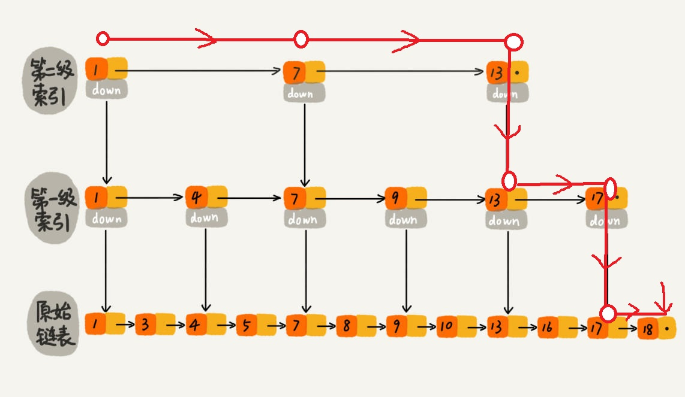

# 并发容器
## 一 JDK提供的容器

JDK 提供的这些容器大部分在 java.util.concurrent 包中。

* ConcurrentHashMap: 线程安全的 HashMap
* CopyOnWriteArrayList: 线程安全的 List，在读多写少的场合性能非常好，远远好于 Vector.
* ConcurrentLinkedQueue: 高效的并发队列，使用链表实现。可以看做一个线程安全的 LinkedList，这是一个非阻塞队列。
* BlockingQueue: 这是一个接口，JDK 内部通过链表、数组等方式实现了这个接口。表示阻塞队列，非常适合用于作为数据共享的通道。
* ConcurrentSkipListMap: 跳表的实现。这是一个 Map，使用跳表的数据结构进行快速查找。

## 二 ConcurrentHashMap

在 ConcurrentHashMap 中，无论是读操作还是写操作都能保证很高的性能：在进行读操作时(几乎)不需要加锁，而在写操作时通过锁分段技术只对所操作的段加锁而不影响客户端对其它段的访问。

## 三 CopyOnWriteArrayList

ReentrantReadWriteLock 读写锁的思想: 读读共享、写写互斥、读写互斥、写读互斥。

CopyOnWriteArrayList 类比相比于在读写锁的思想又更进一步。为了将读取的性能发挥到极致，CopyOnWriteArrayList 读取是完全不用加锁的，并且更厉害的是：写入也不会阻塞读取操作。只有写入和写入之间需要进行同步等待。

### 实现原理

类的所有可变操作（add，set 等等）都是通过创建底层数组的新副本来实现的。当 List 需要被修改的时候，我并不修改原有内容，而是对原有数据进行一次复制，将修改的内容写入副本。写完之后，再将修改完的副本替换原来的数据，这样就可以保证写操作不会影响读操作了。

### 源码

读取操作没有任何同步控制和锁操作，理由就是内部数组 array 不会发生修改，只会被另外一个 array 替换，因此可以保证数据安全。
```java
/** The array, accessed only via getArray/setArray. */
private transient volatile Object[] array;
public E get(int index) {
    return get(getArray(), index);
}
@SuppressWarnings("unchecked")
private E get(Object[] a, int index) {
    return (E) a[index];
}
final Object[] getArray() {
    return array;
}
```

CopyOnWriteArrayList 写入操作 add() 方法在添加集合的时候加了锁，保证了同步，避免了多线程写的时候会 copy 出多个副本出来。
```java
/**
    * Appends the specified element to the end of this list.
    *
    * @param e element to be appended to this list
    * @return {@code true} (as specified by {@link Collection#add})
    */
public boolean add(E e) {
    final ReentrantLock lock = this.lock;
    lock.lock();//加锁
    try {
        Object[] elements = getArray();
        int len = elements.length;
        Object[] newElements = Arrays.copyOf(elements, len + 1);//拷贝新数组
        newElements[len] = e;
        setArray(newElements);
        return true;
    } finally {
        lock.unlock();//释放锁
    }
}
```

## 四 ConcurrentLinkedQueue

Java 提供的线程安全的 Queue 可以分为阻塞队列和非阻塞队列，其中阻塞队列的典型例子是 BlockingQueue，非阻塞队列的典型例子是 ConcurrentLinkedQueue 。

**阻塞队列可以通过加锁来实现，非阻塞队列可以通过 CAS 操作实现。**

ConcurrentLinkedQueue 应该算是在高并发环境中性能最好的队列了。主要使用 CAS 非阻塞算法来实现线程安全。

## 五 BlockingQueue

阻塞队列（BlockingQueue）被广泛使用在“生产者-消费者”问题中，其原因是 BlockingQueue 提供了可阻塞的插入和移除的方法。当队列容器已满，生产者线程会被阻塞，直到队列未满；当队列容器为空时，消费者线程会被阻塞，直至队列非空时为止。

**BlockingQueue 是一个接口，继承自 Queue，所以其实现类也可以作为 Queue 的实现来使用，而 Queue 又继承自 Collection 接口**


### 5.1 ArrayBlockingQueue

ArrayBlockingQueue 是 BlockingQueue 接口的有界队列实现类，底层采用数组来实现。ArrayBlockingQueue 一旦创建，容量不能改变。其并发控制采用可重入锁来控制，不管是插入操作还是读取操作，都需要获取到锁才能进行操作。当队列容量满时，尝试将元素放入队列将导致操作阻塞;尝试从一个空队列中取一个元素也会同样阻塞。

ArrayBlockingQueue 默认情况下不能保证线程访问队列的公平性，如果保证公平性，通常会降低吞吐量。如果需要获得公平性的 ArrayBlockingQueue，可采用如下代码：

```java
private static ArrayBlockingQueue<Integer> blockingQueue = new ArrayBlockingQueue<Integer>(10,true);
```

### 5.2 LinkedBlockingQueue

LinkedBlockingQueue 底层基于单向链表实现的阻塞队列，可以当做无界队列也可以当做有界队列来使用，同样满足 FIFO 的特性，与 ArrayBlockingQueue 相比起来具有更高的吞吐量，为了防止 LinkedBlockingQueue 容量迅速增，损耗大量内存。通常在创建 LinkedBlockingQueue 对象时，会指定其大小，如果未指定，容量等于 Integer.MAX_VALUE。

```java
/**
*某种意义上的无界队列
* Creates a {@code LinkedBlockingQueue} with a capacity of
* {@link Integer#MAX_VALUE}.
*/
public LinkedBlockingQueue() {
    this(Integer.MAX_VALUE);
}
/**
*有界队列
* Creates a {@code LinkedBlockingQueue} with the given (fixed) capacity.
*
* @param capacity the capacity of this queue
* @throws IllegalArgumentException if {@code capacity} is not greater
*         than zero
*/
public LinkedBlockingQueue(int capacity) {
    if (capacity <= 0) throw new IllegalArgumentException();
    this.capacity = capacity;
    last = head = new Node<E>(null);
}
```

### 5.3 PriorityBlockingQueue

PriorityBlockingQueue 是一个支持优先级的无界阻塞队列。默认情况下元素采用自然顺序进行排序，也可以通过自定义类实现 compareTo() 方法来指定元素排序规则，或者初始化时通过构造器参数 Comparator 来指定排序规则。

PriorityBlockingQueue 并发控制采用的是 ReentrantLock，队列为无界队列。 PriorityBlockingQueue 只能指定初始的队列大小，后面插入元素的时候，如果空间不够的话会自动扩容。

## 六 ConcurrentSkipListMap
### 跳表
跳表是一种可以用来快速查找的数据结构，有点类似于平衡树。它们都可以对元素进行快速的查找。对平衡树的插入和删除往往很可能导致平衡树进行一次全局的调整。而对跳表的插入和删除只需要对整个数据结构的局部进行操作即可。在高并发的情况下，你会需要一个全局锁来保证整个平衡树的线程安全。而对于跳表，你只需要部分锁即可。


最低层的链表维护了跳表内所有的元素，每上面一层链表都是下面一层的子集。

跳表内的所有链表的元素都是排序的。查找时，可以从顶级链表开始找。一旦发现被查找的元素大于当前链表中的取值，就会转入下一层链表继续找。



假如我们要查询11，那么我们从最上层出发，发现下一个是5，再下一个是13，已经大于11，所以进入下一层，下一层的一个是9，查找下一个，下一个又是13，再次进入下一层。最终找到11。


