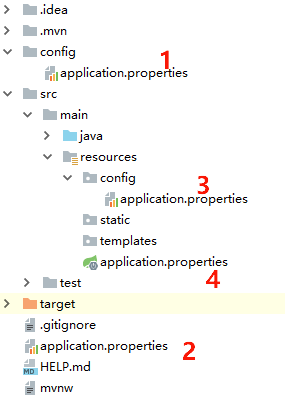
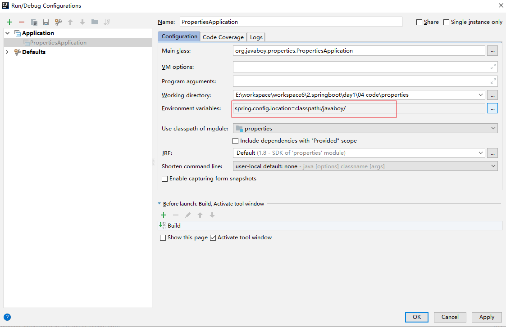
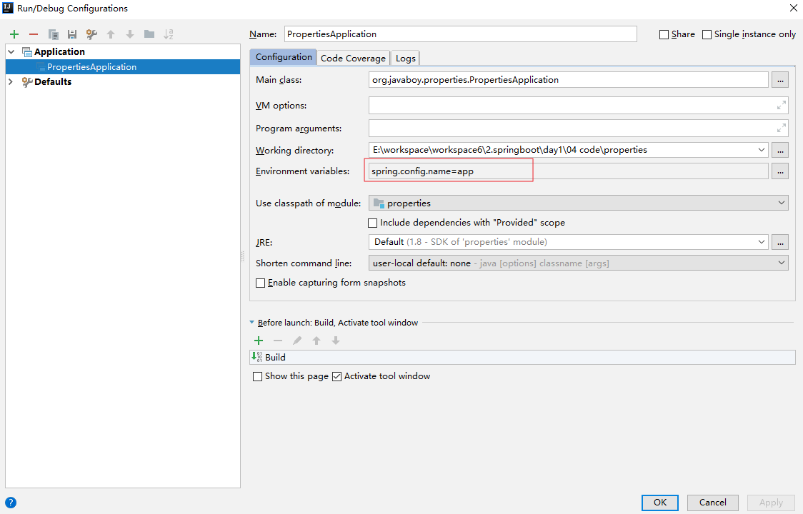

# Spring Boot

## parent 依赖
parent 不仅仅是统一管控依赖以及依赖版本。

### 基本功能
* 定义了`Java`编译版本为 1.8 。
* 使用`UTF-8`格式编码。
* 继承自`spring-boot-dependencies`，这个里边定义了依赖的版本，也正是因为继承了这个依赖，所以我们在写依赖时才不需要写版本号。
* 执行打包操作的配置。
* 自动化的资源过滤。
* 自动化的插件配置。
* 针对`application.properties`和`application.yml`的资源过滤，包括通过`profile`定义的不同环境的配置文件，例如`application-dev.properties`和`application-dev.yml`。

## 配置文件
### application.properties
虽然比较常见，但简洁程度和使用场景都不及 yaml，且数据是无序的，在一些需要路径匹配的配置中，顺序尤为重要。

#### 位置
application.properties 文件默认存放在以下位置：
* 当前项目根目录下的 config 目录下
* 当前项目的根目录下
* resources 目录下的 config 目录下
* resources 目录下

优先级如下



可以自定义存放位置，通过 spring.config.location 属性来手动的指定配置文件位置。



如果项目已经打包成 jar ，在启动命令中加入位置参数即可：
```
java -jar properties-0.0.1-SNAPSHOT.jar --spring.config.location=classpath:/javaboy/
```

#### 文件名

除了 application 之外，也可叫其他名字，需要明确指定配置文件的文件名。方式和指定路径一致，只不过此时的 key 是 spring.config.name。



配置文件位置和文件名称可以同时自定义。

#### 属性注入

简单的属性注入可以直接写在 properties 文件中，
```java
public class Book {
    private Long id;
    private String name;
    private String author;
    //省略 getter/setter
}
```
```properties
book.name=三国演义
book.author=罗贯中
book.id=1
```
```java
@Component
public class Book {
    @Value("${book.id}")
    private Long id;
    @Value("${book.name}")
    private String name;
    @Value("${book.author}")
    private String author;
    //省略getter/setter
}
```
Book 对象本身也要交给 Spring 容器去管理，如果 Book 没有交给 Spring 容器，那么 Book 中的属性也无法从 Spring 容器中获取到值。


配置完成后，在 Controller 或者单元测试中注入 Book 对象，启动项目，就可以看到属性已经注入到对象中了。

可以通过xml文件引用 properties 文件
```xml
<context:property-placeholder location="classpath:book.properties"/>
```
Java 配置中，可以通过 @PropertySource 引入配置
```java
@Component
@PropertySource("classpath:book.properties")
public class Book {
    @Value("${book.id}")
    private Long id;
    @Value("${book.name}")
    private String name;
    @Value("${book.author}")
    private String author;
    //getter/setter
}
```
可以使用类型安全的属性注入，引入 @ConfigurationProperties(prefix = “book”) 注解，并且配置了属性的前缀，此时会自动将 Spring 容器中对应的数据注入到对象对应的属性中，就不用通过 @Value 注解挨个注入了，减少工作量并且避免出错。
```java
@Component
@PropertySource("classpath:book.properties")
@ConfigurationProperties(prefix = "book")
public class Book {
    private Long id;
    private String name;
    private String author;
    //省略getter/setter
}
```

## yaml
和 properties 一致，只是 yaml 是有序的， properties 配置是无序的。

## resources 资源路径配置
默认情况下，如果没有指定resources，目前认为自动会将src/main/resources下的.xml文件放到target里头的classes文件夹下的package下的文件夹里。

如果设定了resources，那么默认的就会失效,因此需要设置指定resources文件夹。

利用复制文件的特性，可以复制一些文件到指定的目录。 但是，一定要先指定resources文件目录，再指定要复制的文件
如下：

* 第一个resource 是复制特定文件
* 第二个resource 是可以使用pom中的profile替换相关的值
* 第三个resource 指定resources文件目录(一旦增加了resources节点，默认的resource目录就失效了,需要重新指定)

```
<build>
    <resources>
        <resource>
            <directory>${project.basedir}/libs</directory>
            <targetPath>BOOT-INF/lib/</targetPath>
                <includes>
                    <include>**/*.jar</include>
                </includes>
        </resource>
        <resource>
            <directory>src/main/java</directory>
            <includes>
                <include>com/changfu/business/tpp/util/templates/**.html</include>
            </includes>
            <filter>true</filter>
        </resource>
        <resource>
            <directory>src/main/resources</directory>
        </resource>
    </resources>
</build>
```

也许有人会有疑问，若只需要过滤context.xml的话，那就只需要配置第一个resource就可以了吧。其实不然，若是只配置第一个resource，第二个不配置，那么当你运行maven打包操作后，你就会发现，在工程的classpath下只有context.xml文件了，其他配置文件都没有打过来。所以第二个resource是必不可少的，指明其他配置文件是不需要过滤的，但是同样需要打包到classpath下。

其实filtering为true的时候，这时只会把过滤的文件打到classpath下，filtering为false的时候，会把不需要过滤的文件打到classpath下。

还有一点需要说明，若`<filtering>`、`<include>`和`<exclude>`都不配置，就是把directory下的所有配置文件都放到classpath下，若这时如下配置

## 自动配置
@ConditionalOnClass(App.class) 表示当前项目当前 classpath 下存在App时，后面的配置才生效

### 条件注解
容器启动时，会执行注解了 `@Configuration` 的类，在 FoodConfig 类中注解了 `@Conditional` ， 会去执行 `@Conditional` 中声明的判断类的判断方法，判断成功返回相应的 Bean。

## 全局错误页面
Spring Boot 直接配置资源就能使用报错页面。404.html 命名即404错误时直接使用404.html，4xx.html即所有4开头的错误都可以使用。

静态页面路径：classpath:/static/error

动态页面路径：classpath:/template/error

SpringBoot查找错误页面的逻辑：发生404错误->查到动态404.html->查到静态404.html->查到动态4xx.html->查到静态4xx.html

### 动态页面数据
动态错误页面默认有以下数据可以使用：path, error, message, timestamp, status

想要自定义这些参数，有两种方法：

* 直接实现 `ErrorAttributies` 接口
* 继承 `DefaultErrorAttributes` (推荐)，因为该类中对异常数据的处理已完成。

### 自定义异常视图
因为 `DefaultErrorViewResolver` 是在 `ErrorMvcAutoConfiguration` 类中提供的实例，开发者没有提供相应实例时，会使用 `DefaultErrorViewResolver` ，开发者提供了自己的 `ErrorViewResolver` 之后，默认配置失效。

```java
/**
 * 自定义异常视图解析类
 */
@Component
public class LocalErrorViewResolver extends DefaultErrorViewResolver {
    public LocalErrorViewResolver(ApplicationContext context, ResourceProperties properties) {
        super(context, properties);
    }
    @Override
    public ModelAndView resolveErrorView(HttpServletRequest request, HttpStatus status, Map<String, Object> model) {
        // aaa/123 实际指 classpath:/aaa/123.html
        return new ModelAndView("/aaa/123", model);
    }
}
```
> 想要自定义模型数据，重写一个model，将参数中的的model拷贝过去（因为这个参数model是UnmodifiableMap类型，不可编辑）

## CORS 跨域问题
因为同源策略，协议、域名、端口要相同，传统JSONP只支持get请求，现在普遍使用CORS实现跨域。

使用 `@CrossOrigin` 注解就能设置某一接口接受某域名的跨域，get post都一样。
```java
@RestController
public class HelloController {
    @CrossOrigin("http://localhost:9091")
    @PostMapping("/hello")
    public String hello2() {
        return "post hello";
    }
}
```

也可以通过配置类进行全局配置
```java
@Configuration
public class WebMVCConfig implements WebMvcConfigurer {
    @Override
    public void addCorsMappings(CorsRegistry registry) {
        registry.addMapping("/**")
            .allowedOrigins("http://localhost:9091")
            .allowedMethods("*")
            .allowedHeaders("*");
    }
}
```

## 服务启动的自动任务
```java
@Component
@Order(100)
public class LocalCommandLineRunner1 implements CommandLineRunner {
    @Override
    public void run(String... args) throws Exception {
        // TODO
    }
}
```
将首先需要将类在容器中注册，类必须实现 `CommandLineRunner` 接口，`@order` 注解表示优先级，数字越小优先级越大。run方法的参数来自于项目启动的参数，即入口类mian方法的参数会传到这里。

## 定时任务
### 使用 `@Scheduled` 注解

使用 Schedule 注解需要配置类包括 `@EnableScheduling` 注解，开启定时任务。

然后在bean中的方法上添加注解 `@Scheduled`，设定任务，参数可以设置执行的规律。默认是单线程执行。
```java
@Configuration
@EnableScheduling
public class LocalTimingTask {
    // 两次任务开始时间之间的间隔
    // @Scheduled(fixedRate = 2000)
    public void fixedRate() {
        System.out.println("fixedRate>>>>" + new Date());
    }
    // 上次任务结束和下次任务开始之间的间隔
    // @Scheduled(fixedDelay = 2000)
    public void fixedDelay() {
        System.out.println("fixedDelay>>>>" + new Date());
    }
    // 首次启动任务的延迟时间
    // @Scheduled(initialDelay = 2000, fixedDelay = 2000)
    public void initialDelay() {
        System.out.println("initialDelay>>>>" + new Date());
    }
}
```
> @schedule注解支持cron表达式，支持丰富的规则设定。

### 第三方框架 Quartz
引用：略

也需要开启任务注解 `@EnableScheduling`

有两个关键概念：jobDetail(要做的事情)，触发器(什么时候做)

定义Job有两种方法，一种直接声明一个Bean就行，另一种需要继承`QuartzJobBean`类，然后实现默认方法。

## 整合swagger
因为spring boot 没有直接配置swagger，所以需要手动配置依赖，并且要指定版本。

```java
@Configuration
@EnableSwagger2
public class SwaggerConfig {
    @Bean
    public Docket createRestApi() {
        return new Docket(DocumentationType.SWAGGER_2)
            .pathMapping("/")
            .select()
            .apis(RequestHandlerSelectors.basePackage("com.bootdemo"))
            .paths(PathSelectors.any())
            .build().apiInfo(new ApiInfoBuilder()
                .title("Swagger 自动文档")
                .description("详细信息...")
                .version("9.0")
                .contact(new Contact("你好你好", "www.baidu.com", "aaa@aaa.com"))
                .license("The Apache License")
                .licenseUrl("http://www.bootdemo.com")
                .build()
            );
    }
}
```

swagger 注解
* @Api注解可以用来标记当前Controller的功能。
* @ApiOperation注解用来标记一个方法的作用。
* @ApiImplicitParam注解用来描述一个参数，可以配置参数的中文含义，也可以给参数设置默认值，这样在接口测试的时候可以避免手动输入。
* 如果有多个参数，则需要使用多个@ApiImplicitParam注解来描述，多个@ApiImplicitParam注解需要放在一个@ApiImplicitParams注解中。
* 需要注意的是，@ApiImplicitParam注解中虽然可以指定参数是必填的，但是却不能代替@RequestParam(required = true)，前者的必填只是在Swagger2框架内必填，抛弃了Swagger2，这个限制就没用了，所以假如开发者需要指定一个参数必填，@RequestParam(required = true)注解还是不能省略。
* 如果参数是一个对象（例如上文的更新接口），对于参数的描述也可以放在实体类中。例如下面一段代码：
```java
@ApiModel
public class User {
    @ApiModelProperty(value = "用户id")
    private Integer id;
}
```

### Swagger 与 Security
如果我们的Spring Boot项目中集成了Spring Security，那么如果不做额外配置，Swagger2文档可能会被拦截，此时只需要在Spring Security的配置类中重写configure方法，添加如下过滤即可：
```java
@Override public void configure(WebSecurity web) throws Exception {
    web.ignoring()
        .antMatchers("/swagger-ui.html")
        .antMatchers("/v2/**")
        .antMatchers("/swagger-resources/**");
}
```

## 整合 JDBC
首先，需要引入相应依赖

```xml
<dependency>
    <groupId>com.alibaba</groupId>
    <artifactId>druid-spring-boot-starter</artifactId>
    <version>1.1.10</version>
</dependency>
<dependency>
    <groupId>mysql</groupId>
    <artifactId>mysql-connector-java</artifactId>
    <version>8.0.21</version>
    <scope>runtime</scope>
</dependency>
<dependency>
    <groupId>org.springframework.boot</groupId>
    <artifactId>spring-boot-starter-jdbc</artifactId>
</dependency>
```
其中数据库连接依赖版本需要和实际数据库的依赖版本一致。

使用时，先定义一个实体Bea，然后针对该Bean定义一个Service，用Autowired引入JdbcTemplate实例。

JdbcTemplate 中，除了查询有几个API外，增删改统一用 update 操作。