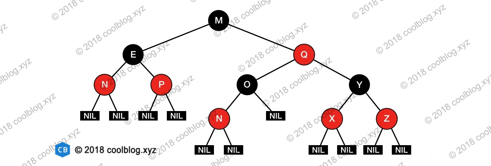
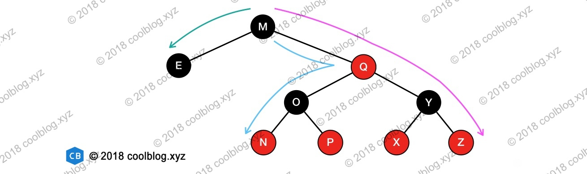
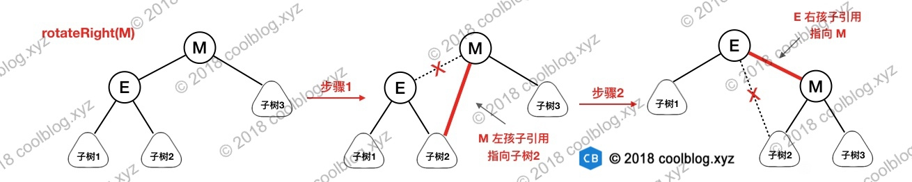

# 红黑树
## 1 简介
自平衡二叉查找树，在 O(logN) 时间内完成查找。

## 2 性质

1. 节点是红色或黑色。
2. 根是黑色。
3. 所有叶子都是黑色（叶子是NIL节点）。
4. 每个红色节点必须有两个黑色的子节点。（从每个叶子到根的所有路径上不能有两个连续的红色节点。）
5. 从任一节点到其每个叶子的所有简单路径都包含相同数目的黑色节点（简称黑高）。

有了这4\5两个性质作为约束，即可保证任意节点到其每个叶子节点路径最长不会超过最短路径的2倍。原因如下：

当某条路径最短时，这条路径必然都是由黑色节点构成。当某条路径长度最长时，这条路径必然是由红色和黑色节点相间构成（性质4限定了不能出现两个连续的红色节点）。

而性质5又限定了从任一节点到其每个叶子节点的所有路径必须包含相同数量的黑色节点。此时，在路径最长的情况下，路径上红色节点数量 = 黑色节点数量。该路径长度为两倍黑色节点数量，也就是最短路径长度的2倍。

最长路径有4条，长度为4

M -> Q -> O -> N

M -> Q -> O -> p

M -> Q -> Y -> X

M -> Q -> Y -> Z

最短路径为 M -> E ，长度为2

最长路径的长度正好为最短路径长度的2倍。

## 3 操作
### 3.1 旋转
旋转操作分为左旋和右旋，左旋是将某个节点旋转为其右孩子的左孩子，而右旋是节点旋转为其左孩子的右孩子。

举例右旋步骤:
1. 将节点 M 的左孩子引用指向节点 E 的右孩子
2. 将节点 E 的右孩子引用指向节点 M，完成旋转

左旋类似

### 3.2 插入
红黑树插入新节点后，需要进行调整，以满足红黑树的性质。

性质1规定红黑树节点的颜色要么是红色要么是黑色，那么在插入新节点时，这个节点应该是红色。

原因:

如果插入的节点是黑色，那么这个节点所在路径比其他路径多出一个黑色节点，这个调整起来会比较麻烦。

如果插入的节点是红色，此时所有路径上的黑色节点数量不变，仅可能会出现两个连续的红色节点的情况。这种情况下，通过变色和旋转进行调整即可，比之前的简单多了。

接下来，将分析插入红色节点后红黑树的情况。这里假设要插入的节点为 N，N 的父节点为 P，祖父节点为 G，叔叔节点为 U。插入红色节点后，会出现5种情况，分别如下：

#### 3.2.1 情况一
插入的新节点 N 是红黑树的根节点。

这种情况下，我们把节点 N 的颜色由红色变为黑色，性质2（根是黑色），性质5（从任一节点到其每个叶子的所有简单路径都包含相同数目的黑色节点）被满足。

#### 3.2.1 情况二
N 的父节点是黑色，这种情况下，性质4（每个红色节点必须有两个黑色的子节点）和性质5没有受到影响，不需要调整。

#### 3.2.1 情况三
N 的父节点是红色（节点 P 为红色，其父节点必然为黑色），叔叔节点 U 也是红色。不满足性质四(从每个叶子到根的所有路径上不能有两个连续的红色节点)。

#### 3.2.1 情况四
N 的父节点为红色，叔叔节点为黑色。节点 N 是 P 的右孩子，且节点 P 是 G 的左孩子。

此时先对节点 P 进行左旋，调整 N 与 P 的位置。接下来按照情况五进行处理，以恢复性质4。

#### 3.2.1 情况五
N 的父节点为红色，叔叔节点为黑色。N 是 P 的左孩子，且节点 P 是 G 的左孩子。此时对 G 进行右旋，调整 P 和 G 的位置，并互换颜色。经过这样的调整后，性质4被恢复，同时也未破坏性质5。

#### 3.2.1 总结
情况三、四、五的区别在于叔叔节点的颜色，如果叔叔节点为红色，直接变色即可。如果叔叔节点为黑色，则需要选选择，再交换颜色。

### 3.3 删除
删除操作首先要确定待删除节点有几个孩子，如果有两个孩子，不能直接删除该节点。而是要先找到该节点的前驱（该节点左子树中最大的节点）或者后继（该节点右子树中最小的节点），然后将前驱或者后继的值复制到要删除的节点中，最后再将前驱或后继删除。

由于前驱和后继至多只有一个孩子节点，这样我们就把原来要删除的节点有两个孩子的问题转化为只有一个孩子节点的问题，问题被简化了一些。我们并不关心最终被删除的节点是否是我们开始想要删除的那个节点，只要节点里的值最终被删除就行了，至于树结构如何变化，这个并不重要。

红黑树删除操作的复杂度在于删除节点的颜色，当删除的节点是红色时，直接拿其孩子节点补空位即可。因为删除红色节点，性质5（从任一节点到其每个叶子的所有简单路径都包含相同数目的黑色节点）仍能够被满足。

当删除的节点是黑色时，那么所有经过该节点的路径上的黑节点数量少了一个，破坏了性质5。如果该节点的孩子为红色，直接拿孩子节点替换被删除的节点，并将孩子节点染成黑色，即可恢复性质5。但如果孩子节点为黑色，处理起来就要复杂的多，分为6种情况。

> 这里假设最终被删除的节点为X（至多只有一个孩子节点），其孩子节点为N，X的兄弟节点为S，S的左节点为 SL，右节点为 SR。接下来讨论是建立在节点 X 被删除，节点 N 替换X的基础上进行的。

#### 3.2.1 情况一
> N 是新的根。在这种情形下，我们就做完了。我们从所有路径去除了一个黑色节点，而新根是黑色的，所以性质都保持着。

可能的解释: 要删除的节点 X 是根节点，且左右孩子节点均为空节点，此时将节点 X 用空节点替换完成删除操作。

#### 3.2.1 情况二
S 为红色，其他节点为黑色。这种情况下可以对 N 的父节点进行左旋操作，然后互换 P 与 S 颜色。

经过节点 P 和 N 的路径删除前有3个黑色节点（P -> X -> N），现在只剩两个了（P -> N）。比未经过 N 的路径少一个黑色节点，性质5仍不满足，还需要继续调整。不过此时可以按照情况四、五、六进行调整。

#### 3.2.1 情况三
N 的父节点，兄弟节点 S 和 S 的孩子节点均为黑色。这种情况下可以简单的把 S 染成红色，所有经过 S 的路径比之前少了一个黑色节点，这样经过 N 的路径和经过 S 的路径黑色节点数量一致了。但经过 P 的路径比不经过 P 的路径少一个黑色节点，此时需要从情况一开始对 P 进行平衡处理。

#### 3.2.1 情况四
N 的父节点为红色，叔叔节点为黑色。节点 N 是 P 的右孩子，且节点 P 是 G 的左孩子。此时先对节点 P 进行左旋，调整 N 与 P 的位置。接下来按照情况五进行处理，以恢复性质4。

#### 3.2.1 情况五
S 为黑色，S 的左孩子为红色，右孩子为黑色。N 的父节点颜色可红可黑，且 N 是 P 左孩子。这种情况下对 S 进行右旋操作，并互换 S 和 SL 的颜色。此时，所有路径上的黑色数量仍然相等，N 兄弟节点的由 S 变为了 SL，而 SL 的右孩子变为红色。接下来我们到情况六继续分析。

#### 3.2.1 情况六

未完待续 http://www.tianxiaobo.com/2018/01/11/%E7%BA%A2%E9%BB%91%E6%A0%91%E8%AF%A6%E7%BB%86%E5%88%86%E6%9E%90/