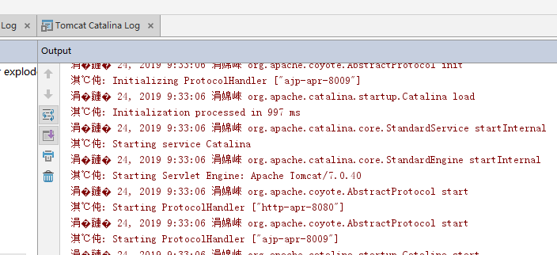
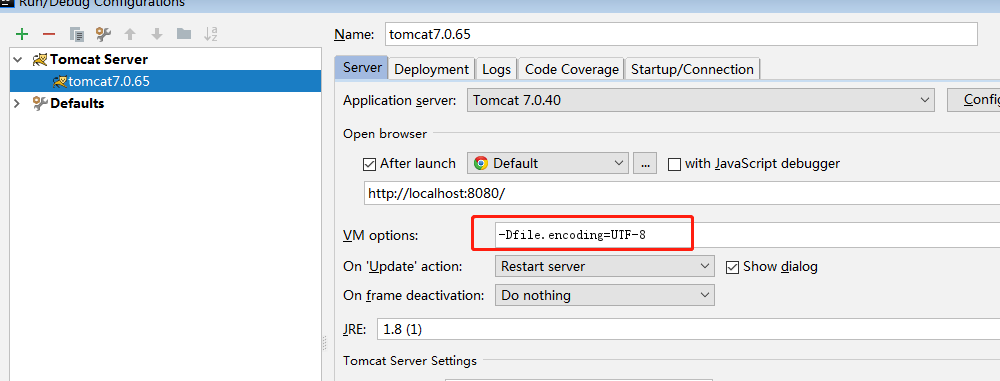
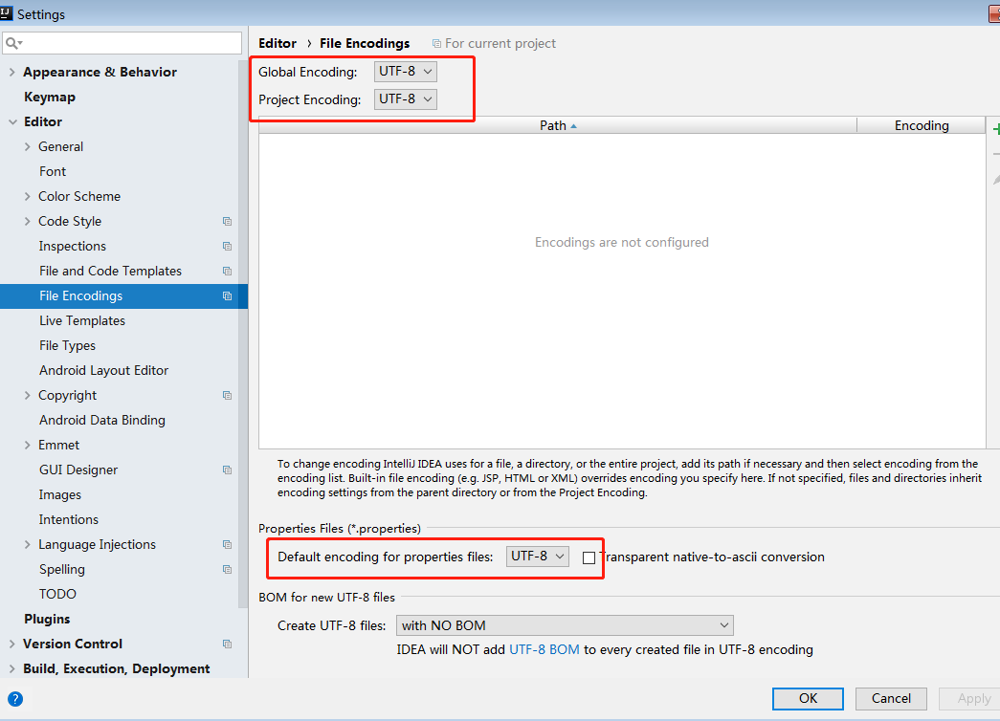
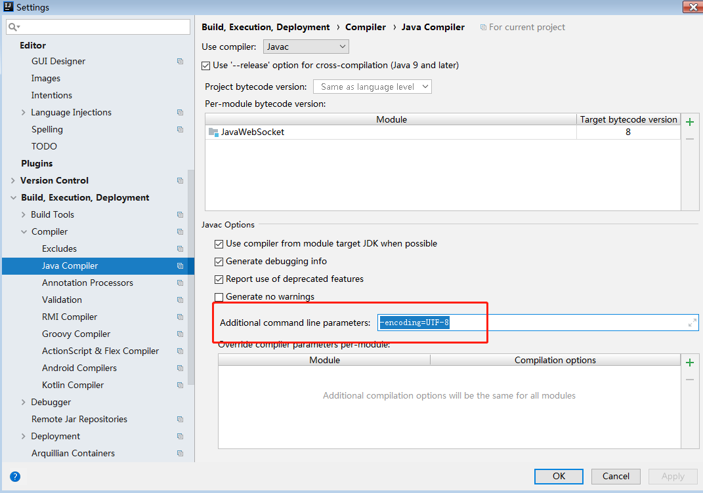
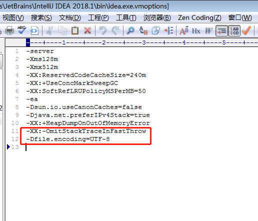
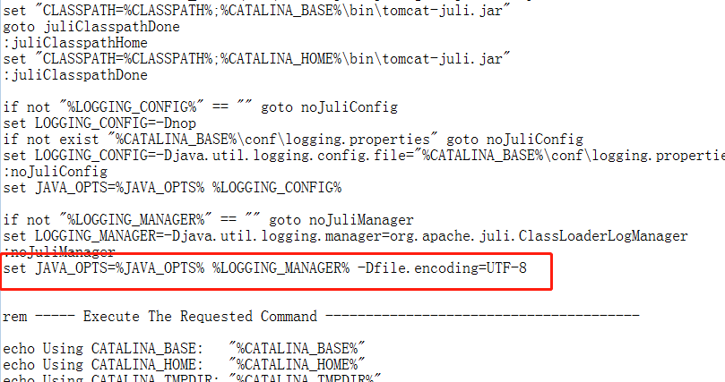
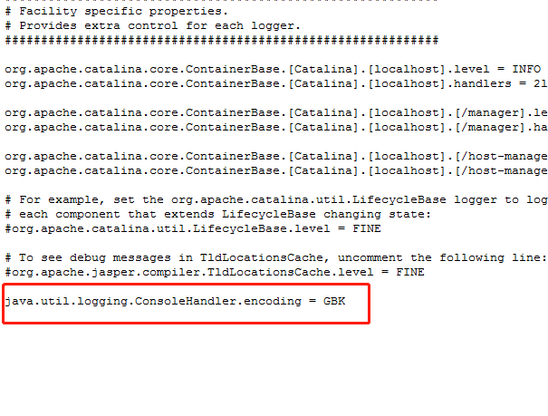
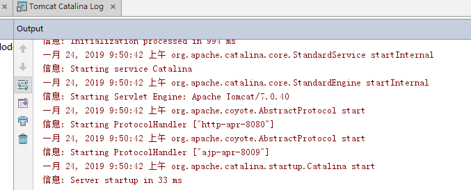

今天使用idea运行tomcat 项目时候出现乱码，上网搜了一下，分享给大家。
问题，在idea中出现乱码问题，以前没有的，好像在设置系统代码为utf8之后就出现了，于是尝试了一系列办法，希望这些办法对您有帮助。
先看一下乱码的样式。


### 设置办法
1、在tomcat Server中设置 VM options , 值为-Dfile.encoding=UTF-8 ，可惜没生效


2、在setting中的 File encodings 中设置编码格式，后来发现这是设置页面编码格式的，所以也没生效，不过遇到相关问题的朋友也不防照此设置下。


3、在java Complier中设置Additional command line parameters的值，-encoding=UTF-8，很可惜还没生效


4、在bin中设置idea.exe.vmoptions和idea64.exe.vmoptions中的参数，同时增加-Dfile.encoding=UTF-8，据说有些人保存后重启就可以了，但到我这边还是没生效。


5、在tomcat \bin目录下的catalina.bat文件中加入-Dfile.encoding=UTF-8，可是还不生效，有些抓狂了...


6、在 tomcat / conf 目录下，设置logging.properties ，增加参数java.util.logging.ConsoleHandler.encoding = GBK，重启后终于可以了，总算松了口气。


终于，正常显示了......


7、另外在服务器上tomcat还需要设置server.xml中的参数，以防页面出现乱码
```
<Connector port="8080" protocol="HTTP/1.1" connectionTimeout="20000" redirectPort="8443" URIEncoding="UTF-8" />
<Connector port="8009" protocol="AJP/1.3" redirectPort="8443" URIEncoding="UTF-8" />

```